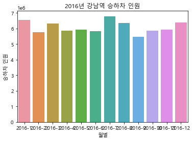
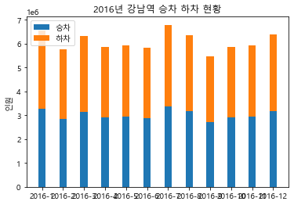
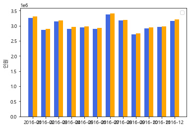
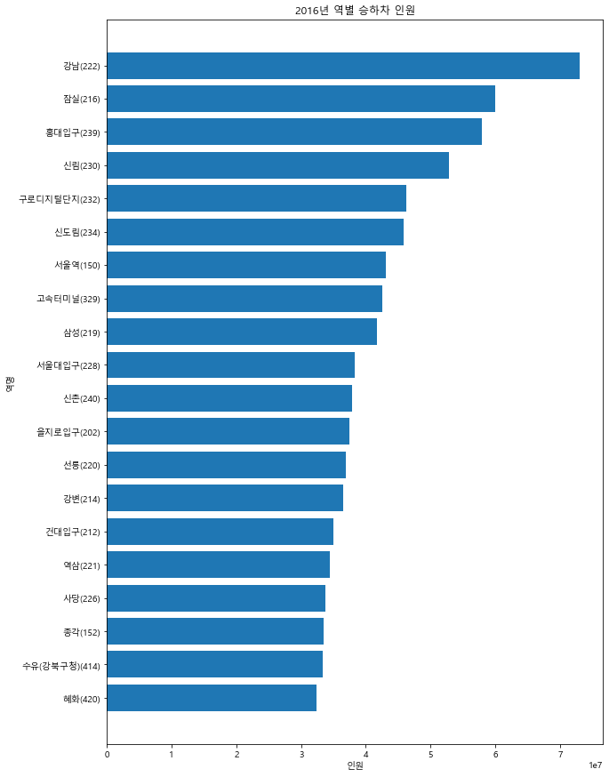

```python
import pandas as pd
import os
```

## 1. 하나의 데이터프레임 만들기

### solution:


```python
#12개의 월별 csv파일을 보면, 각각 데이터 형태가 다르다 - 컬럼수, 컬럼명이 다르다.
all_data = list()
for root, b, files in os.walk("./data/subway"):
    for file in files:
        file_path = root + "/" + file
        print (file_path)
        all_data.append(pd.read_csv(file_path, encoding='euc-kr'))
```


```python
# 형태가 같은 것끼리 먼저 더하고
# 데이터내용이 가장 부족한 것을 기준으로 12개의 파일의 데이터를 합친다.

# 먼저 같은 형태의 1월 ~ 5월까지 데이터 정리
all_data_1 = list()
for month in all_data[:5]:
    tmp = month.groupby(['날짜', '호선', '역명', '구 분']).agg('sum')
    tmp.reset_index(inplace=True)
    tmp.drop(['호선', '04 ~ 05', '02 ~ 03', '03 ~ 04'], axis=1, inplace=True)
    all_data_1.append(tmp)
    
df1 = pd.concat(all_data_1)
```


```python
# 6월 ~ 11월까지 데이터 정리
all_data_2 = list()
for month in all_data[5:-1]:
    all_data_2.append(month[['날짜', '역명', '구분', '05~06', '06~07', '07~08', '08~09', '09~10', '10~11',
       '11~12', '12~13', '13~14', '14~15', '15~16', '16~17', '17~18', '18~19',
       '19~20', '20~21', '21~22', '22~23', '23~24', '00~01', '01~02']])
```


```python
# 마지막 12월 데이터 정리
month12 = all_data[-1][['날짜', '역명', '구분', '05~06시', '06~07시', '07~08시', '08~09시', '09~10시',
       '10~11시', '11~12시', '12~13시', '13~14시', '14~15시', '15~16시', '16~17시',
       '17~18시', '18~19시', '19~20시', '20~21시', '21~22시', '22~23시', '23~24시',
       '00~01시', '01~02시']]
```


```python
df2 = pd.concat(all_data_2)
```


```python
df1.columns = df2.columns.tolist()
month12.columns = df2.columns.tolist()
```


```python
# 12개의 파일의 데이터를 모두 합쳐서 하나의 데이터프레임 생성
df_all = pd.concat([df1, df2, month12])
```


```python
df_all.head()
```


```python
#csv로 저장
df_all.to_csv("Subway_2016.csv", encoding='utf-8-sig')
```

#### my attemp1:

디렉토리에 있는 파일을 불러올때 바로 파일의 데이터를 전처리해서 그래프로 그릴 데이터를 추출했다.

이 방식 보다는, 하나의 원본 dataframe(csv)를 생성해서 여러 방식으로 데이터를 분석하는 것이 옳다.


```python
#utf-8으로 읽으려할때 에러가 발생하면, euc-kr 또는 cp9494를 대신 사용한다. (excel에서 euc-kr로 저장되는경우)
jan = pd.read_csv('./data/subway/Subway_201601.csv', delimiter=',', encoding="euc-kr")
```


```python
# 1월 데이터를 받아서(dataframe=jan) 전처리를 수행해본다.
jan_melt = pd.melt(jan, id_vars=['날짜','호선','역명','구 분','할인'],
                  var_name='시간', value_name='인원')

jan_melt.groupby(['역명','구 분'])[['인원']].sum()

tmp = jan_melt.groupby(['역명','구 분'], as_index=False)[['인원']].sum()
tmp['월']='2016-01'
t = tmp[tmp['역명']=='강남(222)']
```


```python
# 다른 형태의 데이터 셋을 가진 파일들도 가만하여 try,except 처리
annual = []
for roots, dirs, files in os.walk('./data/subway'):
    for idx, file in enumerate(files,1):
        monthly = pd.read_csv(roots+'/'+file, delimiter=',', encoding="euc-kr")
        try:
            monthly_melt = pd.melt(monthly, id_vars=['날짜','호선','역명','구 분','할인'],
                  var_name='시간', value_name='인원')
        # 6월 파일 컬럼명이 다르다.
        except:
            monthly_melt = pd.melt(monthly, id_vars=['역명','날짜','구분'],
                  var_name='시간', value_name='인원')
            
        tmp = monthly_melt.groupby(['역명'], as_index=False)[['인원']].sum()
        tmp['월']='2016-{}'.format(idx)
        t = tmp[tmp['역명']=='강남(222)']
        annual.append(t)               
```


```python
df = pd.concat(annual, ignore_index=True)
```

## 2. 강남역 승하차 Bar chart 그리기


```python
# matplotlib 한글 폰트 오류 문제 해결
from matplotlib import font_manager, rc

font_path = "C:\\Windows\\Fonts\\malgun.ttf"   #폰트파일의 위치
font_name = font_manager.FontProperties(fname=font_path).get_name()
rc('font', family=font_name)
```


```python
import matplotlib.pyplot as plt
import seaborn as sns

b = plt.figure()
b = sns.barplot(x='월',y='인원',data=df)
b.set_title('2016년 강남역 승하차 인원')
b.set_xlabel('월별')
b.set_ylabel('승하차 인원')
```


    Text(0, 0.5, '승하차 인원')


    

    


# 3. 승차, 하차 구분하기


```python
annual2 = []
for roots, dirs, files in os.walk('./data/subway'):
    for idx, file in enumerate(files,1):
        monthly = pd.read_csv(roots+'/'+file, delimiter=',', encoding="euc-kr")
        try:
            monthly_melt = pd.melt(monthly, id_vars=['날짜','호선','역명','구 분','할인'],
                  var_name='시간', value_name='인원')
            tmp = monthly_melt.groupby(['역명','구 분'], as_index=False)[['인원']].sum()
        # 6월 파일 컬럼명이 다르다.
        except:
            monthly_melt = pd.melt(monthly, id_vars=['역명','날짜','구분'],
                  var_name='시간', value_name='인원')
            tmp = monthly_melt.groupby(['역명','구분'], as_index=False)[['인원']].sum()

        tmp['월']='2016-{}'.format(idx)
        t = tmp[tmp['역명']=='강남(222)']
        annual2.append(t)   
```


```python
df2 = pd.concat(annual2, ignore_index=True)
```


```python
df2['구분'].fillna(df2['구 분'], inplace=True)
```


```python
del df2['구 분']
```


```python
df3 = df2[df2['구분']=='승차']
df4 = df2[df2['구분']=='하차']
```


```python
fig, ax = plt.subplots()

width = 0.35

ax.bar(df3['월'], df3['인원'], width, label='승차')
ax.bar(df4['월'], df4['인원'], width, bottom=df3['인원'], label='하차')

ax.set_ylabel('인원')
ax.set_title('2016년 강남역 승차 하차 현황')
ax.legend()

plt.show()
```


    

    


```python
import numpy as np

fig2, ax2 = plt.subplots()

N=12
ind = np.arange(N)
width=0.35

bar1 = ax2.bar(ind, df3['인원'], width, color='royalblue')
bar2 = ax2.bar(ind+width, df4['인원'], width, color='orange')

ax2.set_ylabel('인원')
ax2.set_xticks(ind + width/2)
ax2.set_xticklabels(('2016-01', '2016-02', '2016-03', '2016-04', '2016-05',
                   '2016-06', '2016-07', '2016-08', '2016-09', '2016-10','2016-11','2016-12'))
ax2.legend(())
```


    <matplotlib.legend.Legend at 0x1b308c40048>


    

    


# 4. 승하차 가장 많은 역 그래프로 표현하기


```python
annual3 = []
for roots, dirs, files in os.walk('./data/subway'):
    for idx, file in enumerate(files,1):
        monthly = pd.read_csv(roots+'/'+file, delimiter=',', encoding="euc-kr")
        try:
            monthly_melt = pd.melt(monthly, id_vars=['날짜','호선','역명','구 분','할인'],
                  var_name='시간', value_name='인원')
        # 6월 파일 컬럼명이 다르다.
        except:
            monthly_melt = pd.melt(monthly, id_vars=['역명','날짜','구분'],
                  var_name='시간', value_name='인원')
            
        tmp = monthly_melt.groupby(['역명'], as_index=False)[['인원']].sum()
        annual3.append(tmp) 
```


```python
df5 = pd.concat(annual3, ignore_index=True)
```


```python
df6 = df5.groupby('역명', as_index=False)[['인원']].sum()
df6 = df6.sort_values(by=['인원'])
df7 = df6.tail(20)
```


```python
plt.figure(figsize=(10,15))
plt.barh(df7['역명'],df7['인원'])
plt.title('2016년 역별 승하차 인원')
plt.ylabel('역명')
plt.xlabel('인원')
plt.show()
```


    

    


```python

```
