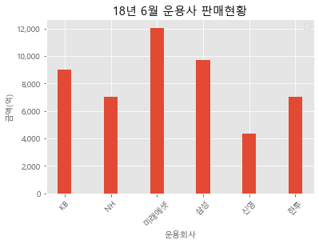

# 과제 1

## data preprocessing practice

### 운용회사 컬럼에서 아래 요구사항대로 변경하기:
    * 미래에셋자산운용 -> 미래에셋 
    * 삼성자산운용, 삼성액티브자산운용 -> 삼성 
    * 케이비자산운용 -> KB
    * 한국투자신탁운용 -> 한투 
    * 엔에이치아문디자산운용 -> NH
    * 신영자산운용 -> 신영 
    * 나머지 운용사는 -> 기타 

#### solution1:


```python
import pandas as pd
fund = pd.read_excel('./data/fund/18년 6월말 기준 운용사 펀드 판매 현황.xls', header=1)
fund.head(3)
```


<div>
<style scoped>
    .dataframe tbody tr th:only-of-type {
        vertical-align: middle;
    }

    .dataframe tbody tr th {
        vertical-align: top;
    }

    .dataframe thead th {
        text-align: right;
    }
</style>
<table border="1" class="dataframe">
  <thead>
    <tr style="text-align: right;">
      <th></th>
      <th>운용회사</th>
      <th>펀드명</th>
      <th>설정일</th>
      <th>펀드유형</th>
      <th>설정원본</th>
      <th>NAV</th>
    </tr>
  </thead>
  <tbody>
    <tr>
      <th>0</th>
      <td>골든브릿지자산운용</td>
      <td>골든브릿지고배당목표전환형증권투자신탁S-3[주식혼합]종류Ae</td>
      <td>20180305</td>
      <td>혼합주식형</td>
      <td>60</td>
      <td>58</td>
    </tr>
    <tr>
      <th>1</th>
      <td>골든브릿지자산운용</td>
      <td>골든브릿지고배당목표전환형증권투자신탁S-3[주식혼합]종류Ce</td>
      <td>20180305</td>
      <td>혼합주식형</td>
      <td>11</td>
      <td>11</td>
    </tr>
    <tr>
      <th>2</th>
      <td>골든브릿지자산운용</td>
      <td>골든브릿지고배당증권투자신탁[주식혼합]종류Ae</td>
      <td>20180122</td>
      <td>혼합주식형</td>
      <td>138</td>
      <td>128</td>
    </tr>
  </tbody>
</table>
</div>


```python
def comp_rename(x):
    if x == "미래에셋자산운용": x= x.replace(x,"미래에셋")
    elif x == "삼성자산운용" or x == "삼성액티브자산운용": x= x.replace(x,"삼성")
    elif x == "케이비자산운용": x= x.replace(x,"KB")
    elif x == "한국투자신탁운용": x= x.replace(x,"한투")
    elif x == "엔에이치아문디자산운용": x= x.replace(x,"NH")
    elif x == "신영자산운용": x= x.replace(x,"신영")
    else: x= x.replace(x,"기타")
    return x
```


```python
fund['운용회사'] = fund['운용회사'].apply(lambda x : comp_rename(x))
fund['운용회사'].unique()
```


    array(['기타', '미래에셋', '삼성', '신영', 'NH', 'KB', '한투'], dtype=object)


#### solution2:


```python
fund_t= pd.read_excel('./data/fund/18년 6월말 기준 운용사 펀드 판매 현황.xls', header=1)
```


```python
fund_t.loc[fund_t['운용회사'] == '미래에셋자산운용', '운용회사'] = '미래에셋'
fund_t.loc[fund_t['운용회사'].isin(['삼성자산운용','삼성액티브자산운용']), '운용회사'] = '삼성'
fund_t.loc[fund_t['운용회사'] == '케이비자산운용', '운용회사']  = 'KB'
fund_t.loc[fund_t['운용회사'] == '한국투자신탁운용', '운용회사']  = '한투'
fund_t.loc[fund_t['운용회사'] == '엔에이치아문디자산운용', '운용회사']  = 'NH'
fund_t.loc[fund_t['운용회사'] == '신영자산운용', '운용회사']  = '신영'
fund_t.loc[~fund_t['운용회사'].isin(['삼성', '한투','미래에셋', 'KB', 'NH', '신영']), '운용회사'] = '기타'
```


```python
fund_t['운용회사'].unique()
```


    array(['기타', '미래에셋', '삼성', '신영', 'NH', 'KB', '한투'], dtype=object)


### NAV(금액)이 백만원 단위에서 억 단위로 될수 있게 변경하기 & 
### 운용회사별 금액 합계를 확인하는 데이터프레임 만들기:

#### solution1:


```python
fund['NAV(억단위)'] = fund['NAV'].apply(lambda x : x/100)
```


```python
fund.head(3)
```


<div>
<style scoped>
    .dataframe tbody tr th:only-of-type {
        vertical-align: middle;
    }

    .dataframe tbody tr th {
        vertical-align: top;
    }

    .dataframe thead th {
        text-align: right;
    }
</style>
<table border="1" class="dataframe">
  <thead>
    <tr style="text-align: right;">
      <th></th>
      <th>운용회사</th>
      <th>펀드명</th>
      <th>설정일</th>
      <th>펀드유형</th>
      <th>설정원본</th>
      <th>NAV</th>
      <th>NAV(억단위)</th>
    </tr>
  </thead>
  <tbody>
    <tr>
      <th>0</th>
      <td>기타</td>
      <td>골든브릿지고배당목표전환형증권투자신탁S-3[주식혼합]종류Ae</td>
      <td>20180305</td>
      <td>혼합주식형</td>
      <td>60</td>
      <td>58</td>
      <td>0.58</td>
    </tr>
    <tr>
      <th>1</th>
      <td>기타</td>
      <td>골든브릿지고배당목표전환형증권투자신탁S-3[주식혼합]종류Ce</td>
      <td>20180305</td>
      <td>혼합주식형</td>
      <td>11</td>
      <td>11</td>
      <td>0.11</td>
    </tr>
    <tr>
      <th>2</th>
      <td>기타</td>
      <td>골든브릿지고배당증권투자신탁[주식혼합]종류Ae</td>
      <td>20180122</td>
      <td>혼합주식형</td>
      <td>138</td>
      <td>128</td>
      <td>1.28</td>
    </tr>
  </tbody>
</table>
</div>


```python
fund = fund.drop(['NAV'], axis=1)
fund.head(3)
```


<div>
<style scoped>
    .dataframe tbody tr th:only-of-type {
        vertical-align: middle;
    }

    .dataframe tbody tr th {
        vertical-align: top;
    }

    .dataframe thead th {
        text-align: right;
    }
</style>
<table border="1" class="dataframe">
  <thead>
    <tr style="text-align: right;">
      <th></th>
      <th>운용회사</th>
      <th>펀드명</th>
      <th>설정일</th>
      <th>펀드유형</th>
      <th>설정원본</th>
      <th>NAV(억단위)</th>
    </tr>
  </thead>
  <tbody>
    <tr>
      <th>0</th>
      <td>기타</td>
      <td>골든브릿지고배당목표전환형증권투자신탁S-3[주식혼합]종류Ae</td>
      <td>20180305</td>
      <td>혼합주식형</td>
      <td>60</td>
      <td>0.58</td>
    </tr>
    <tr>
      <th>1</th>
      <td>기타</td>
      <td>골든브릿지고배당목표전환형증권투자신탁S-3[주식혼합]종류Ce</td>
      <td>20180305</td>
      <td>혼합주식형</td>
      <td>11</td>
      <td>0.11</td>
    </tr>
    <tr>
      <th>2</th>
      <td>기타</td>
      <td>골든브릿지고배당증권투자신탁[주식혼합]종류Ae</td>
      <td>20180122</td>
      <td>혼합주식형</td>
      <td>138</td>
      <td>1.28</td>
    </tr>
  </tbody>
</table>
</div>


```python
fund_1 = fund[fund['운용회사']!="기타"]
fund_result = fund_1.groupby(['운용회사'])[['NAV(억단위)']].sum()
fund_result
```


<div>
<style scoped>
    .dataframe tbody tr th:only-of-type {
        vertical-align: middle;
    }

    .dataframe tbody tr th {
        vertical-align: top;
    }

    .dataframe thead th {
        text-align: right;
    }
</style>
<table border="1" class="dataframe">
  <thead>
    <tr style="text-align: right;">
      <th></th>
      <th>NAV(억단위)</th>
    </tr>
    <tr>
      <th>운용회사</th>
      <th></th>
    </tr>
  </thead>
  <tbody>
    <tr>
      <th>KB</th>
      <td>9029.11</td>
    </tr>
    <tr>
      <th>NH</th>
      <td>7047.08</td>
    </tr>
    <tr>
      <th>미래에셋</th>
      <td>12062.57</td>
    </tr>
    <tr>
      <th>삼성</th>
      <td>9688.68</td>
    </tr>
    <tr>
      <th>신영</th>
      <td>4337.29</td>
    </tr>
    <tr>
      <th>한투</th>
      <td>7021.68</td>
    </tr>
  </tbody>
</table>
</div>


### 아래 그림처럼 시각화를 완성하기:


```python
fund_result.sort_values(by=['NAV(억단위)'])
```


<div>
<style scoped>
    .dataframe tbody tr th:only-of-type {
        vertical-align: middle;
    }

    .dataframe tbody tr th {
        vertical-align: top;
    }

    .dataframe thead th {
        text-align: right;
    }
</style>
<table border="1" class="dataframe">
  <thead>
    <tr style="text-align: right;">
      <th></th>
      <th>NAV(억단위)</th>
    </tr>
    <tr>
      <th>운용회사</th>
      <th></th>
    </tr>
  </thead>
  <tbody>
    <tr>
      <th>신영</th>
      <td>4337.29</td>
    </tr>
    <tr>
      <th>한투</th>
      <td>7021.68</td>
    </tr>
    <tr>
      <th>NH</th>
      <td>7047.08</td>
    </tr>
    <tr>
      <th>KB</th>
      <td>9029.11</td>
    </tr>
    <tr>
      <th>삼성</th>
      <td>9688.68</td>
    </tr>
    <tr>
      <th>미래에셋</th>
      <td>12062.57</td>
    </tr>
  </tbody>
</table>
</div>


```python
# matplotlib 한글 폰트 오류 문제 해결
from matplotlib import font_manager, rc

font_path = "C:\\Windows\\Fonts\\malgun.ttf"   #폰트파일의 위치
font_name = font_manager.FontProperties(fname=font_path).get_name()
rc('font', family=font_name)
```


```python
from matplotlib import pyplot as plt

fund_result.reset_index(inplace=True)

p = plt.bar(fund_result['운용회사'],fund_result['NAV(억단위)'],color="#d62728")
plt.ylabel('금액 (억단위)')
plt.title('18년 6월 운용사 판매현황')
```


    Text(0.5, 1.0, '18년 6월 운용사 판매현황')


    

    


#### solution2:


```python
fund_t['NAV'] = fund_t['NAV'].apply(lambda x: x /100)

fund_result_t = fund_t.groupby(['운용회사'], as_index=False)['NAV'].sum()
fund_result_t
```


<div>
<style scoped>
    .dataframe tbody tr th:only-of-type {
        vertical-align: middle;
    }

    .dataframe tbody tr th {
        vertical-align: top;
    }

    .dataframe thead th {
        text-align: right;
    }
</style>
<table border="1" class="dataframe">
  <thead>
    <tr style="text-align: right;">
      <th></th>
      <th>운용회사</th>
      <th>NAV</th>
    </tr>
  </thead>
  <tbody>
    <tr>
      <th>0</th>
      <td>KB</td>
      <td>9029.11</td>
    </tr>
    <tr>
      <th>1</th>
      <td>NH</td>
      <td>7047.08</td>
    </tr>
    <tr>
      <th>2</th>
      <td>기타</td>
      <td>37633.93</td>
    </tr>
    <tr>
      <th>3</th>
      <td>미래에셋</td>
      <td>12062.57</td>
    </tr>
    <tr>
      <th>4</th>
      <td>삼성</td>
      <td>9688.68</td>
    </tr>
    <tr>
      <th>5</th>
      <td>신영</td>
      <td>4337.29</td>
    </tr>
    <tr>
      <th>6</th>
      <td>한투</td>
      <td>7021.68</td>
    </tr>
  </tbody>
</table>
</div>


```python
fund_result_t.set_index("운용회사",inplace=True)

fund_result_t.drop(["기타"], inplace=True)
```


```python
import matplotlib.pyplot as plt
import matplotlib as mpl

with plt.style.context('ggplot'):
    ax = fund_result_t.plot(kind='bar', title="18년 6월 운용사 판매현황", width=0.3)
    ax.yaxis.set_major_formatter(mpl.ticker.StrMethodFormatter('{x:,.0f}'))
    plt.xticks(rotation=45, fontsize=10)
    plt.xlabel('운용회사', fontsize=10)
    plt.ylabel('금액(억)', fontsize=10)
    plt.legend('')
```


    

    


# 과제 2

## handling & graphing dataframe

### 운용회사별 18년 6월 데이터까지 포함하는 데이터프레임 및 그래프 생성하기:

#### solution:


```python
fund_2 = pd.read_excel('./data/fund/1-2 분기별 현황.xlsx')
fund_2
```


<div>
<style scoped>
    .dataframe tbody tr th:only-of-type {
        vertical-align: middle;
    }

    .dataframe tbody tr th {
        vertical-align: top;
    }

    .dataframe thead th {
        text-align: right;
    }
</style>
<table border="1" class="dataframe">
  <thead>
    <tr style="text-align: right;">
      <th></th>
      <th>구분</th>
      <th>2017 1Q</th>
      <th>2017 2Q</th>
      <th>2017 3Q</th>
      <th>2017 4Q</th>
      <th>2018 1Q</th>
      <th>2018 6월</th>
    </tr>
  </thead>
  <tbody>
    <tr>
      <th>0</th>
      <td>미래에셋</td>
      <td>4749</td>
      <td>5712</td>
      <td>7466</td>
      <td>9463</td>
      <td>12096</td>
      <td>NaN</td>
    </tr>
    <tr>
      <th>1</th>
      <td>KB</td>
      <td>5140</td>
      <td>5272</td>
      <td>5826</td>
      <td>7030</td>
      <td>8597</td>
      <td>NaN</td>
    </tr>
    <tr>
      <th>2</th>
      <td>삼성</td>
      <td>3553</td>
      <td>4377</td>
      <td>5316</td>
      <td>6842</td>
      <td>10476</td>
      <td>NaN</td>
    </tr>
    <tr>
      <th>3</th>
      <td>신영</td>
      <td>2459</td>
      <td>3060</td>
      <td>3549</td>
      <td>4094</td>
      <td>4328</td>
      <td>NaN</td>
    </tr>
    <tr>
      <th>4</th>
      <td>NH</td>
      <td>3195</td>
      <td>3113</td>
      <td>5319</td>
      <td>6366</td>
      <td>7015</td>
      <td>NaN</td>
    </tr>
    <tr>
      <th>5</th>
      <td>한투</td>
      <td>1794</td>
      <td>2063</td>
      <td>2262</td>
      <td>4053</td>
      <td>7323</td>
      <td>NaN</td>
    </tr>
    <tr>
      <th>6</th>
      <td>기타</td>
      <td>16244</td>
      <td>19268</td>
      <td>23137</td>
      <td>28381</td>
      <td>34261</td>
      <td>NaN</td>
    </tr>
    <tr>
      <th>7</th>
      <td>전체</td>
      <td>37133</td>
      <td>42864</td>
      <td>52878</td>
      <td>66975</td>
      <td>84096</td>
      <td>NaN</td>
    </tr>
  </tbody>
</table>
</div>


```python
fund_result = fund_t.groupby(['운용회사'], as_index=False)['NAV'].sum()
fund_result
```


<div>
<style scoped>
    .dataframe tbody tr th:only-of-type {
        vertical-align: middle;
    }

    .dataframe tbody tr th {
        vertical-align: top;
    }

    .dataframe thead th {
        text-align: right;
    }
</style>
<table border="1" class="dataframe">
  <thead>
    <tr style="text-align: right;">
      <th></th>
      <th>운용회사</th>
      <th>NAV</th>
    </tr>
  </thead>
  <tbody>
    <tr>
      <th>0</th>
      <td>KB</td>
      <td>9029.11</td>
    </tr>
    <tr>
      <th>1</th>
      <td>NH</td>
      <td>7047.08</td>
    </tr>
    <tr>
      <th>2</th>
      <td>기타</td>
      <td>37633.93</td>
    </tr>
    <tr>
      <th>3</th>
      <td>미래에셋</td>
      <td>12062.57</td>
    </tr>
    <tr>
      <th>4</th>
      <td>삼성</td>
      <td>9688.68</td>
    </tr>
    <tr>
      <th>5</th>
      <td>신영</td>
      <td>4337.29</td>
    </tr>
    <tr>
      <th>6</th>
      <td>한투</td>
      <td>7021.68</td>
    </tr>
  </tbody>
</table>
</div>


```python
fund_result.loc[7, '운용회사'] = '전체'
fund_result
```


<div>
<style scoped>
    .dataframe tbody tr th:only-of-type {
        vertical-align: middle;
    }

    .dataframe tbody tr th {
        vertical-align: top;
    }

    .dataframe thead th {
        text-align: right;
    }
</style>
<table border="1" class="dataframe">
  <thead>
    <tr style="text-align: right;">
      <th></th>
      <th>운용회사</th>
      <th>NAV</th>
    </tr>
  </thead>
  <tbody>
    <tr>
      <th>0</th>
      <td>KB</td>
      <td>9029.11</td>
    </tr>
    <tr>
      <th>1</th>
      <td>NH</td>
      <td>7047.08</td>
    </tr>
    <tr>
      <th>2</th>
      <td>기타</td>
      <td>37633.93</td>
    </tr>
    <tr>
      <th>3</th>
      <td>미래에셋</td>
      <td>12062.57</td>
    </tr>
    <tr>
      <th>4</th>
      <td>삼성</td>
      <td>9688.68</td>
    </tr>
    <tr>
      <th>5</th>
      <td>신영</td>
      <td>4337.29</td>
    </tr>
    <tr>
      <th>6</th>
      <td>한투</td>
      <td>7021.68</td>
    </tr>
    <tr>
      <th>7</th>
      <td>전체</td>
      <td>NaN</td>
    </tr>
  </tbody>
</table>
</div>


```python
fund_result.loc[7, 'NAV'] = fund_result['NAV'].sum()
fund_result
```


<div>
<style scoped>
    .dataframe tbody tr th:only-of-type {
        vertical-align: middle;
    }

    .dataframe tbody tr th {
        vertical-align: top;
    }

    .dataframe thead th {
        text-align: right;
    }
</style>
<table border="1" class="dataframe">
  <thead>
    <tr style="text-align: right;">
      <th></th>
      <th>운용회사</th>
      <th>NAV</th>
    </tr>
  </thead>
  <tbody>
    <tr>
      <th>0</th>
      <td>KB</td>
      <td>9029.11</td>
    </tr>
    <tr>
      <th>1</th>
      <td>NH</td>
      <td>7047.08</td>
    </tr>
    <tr>
      <th>2</th>
      <td>기타</td>
      <td>37633.93</td>
    </tr>
    <tr>
      <th>3</th>
      <td>미래에셋</td>
      <td>12062.57</td>
    </tr>
    <tr>
      <th>4</th>
      <td>삼성</td>
      <td>9688.68</td>
    </tr>
    <tr>
      <th>5</th>
      <td>신영</td>
      <td>4337.29</td>
    </tr>
    <tr>
      <th>6</th>
      <td>한투</td>
      <td>7021.68</td>
    </tr>
    <tr>
      <th>7</th>
      <td>전체</td>
      <td>86820.34</td>
    </tr>
  </tbody>
</table>
</div>


```python
set(fund_result['운용회사']) - set(fund_2.구분.unique())
```


    set()


```python
fund_result
```


<div>
<style scoped>
    .dataframe tbody tr th:only-of-type {
        vertical-align: middle;
    }

    .dataframe tbody tr th {
        vertical-align: top;
    }

    .dataframe thead th {
        text-align: right;
    }
</style>
<table border="1" class="dataframe">
  <thead>
    <tr style="text-align: right;">
      <th></th>
      <th>운용회사</th>
      <th>NAV</th>
    </tr>
  </thead>
  <tbody>
    <tr>
      <th>0</th>
      <td>KB</td>
      <td>9029.11</td>
    </tr>
    <tr>
      <th>1</th>
      <td>NH</td>
      <td>7047.08</td>
    </tr>
    <tr>
      <th>2</th>
      <td>기타</td>
      <td>37633.93</td>
    </tr>
    <tr>
      <th>3</th>
      <td>미래에셋</td>
      <td>12062.57</td>
    </tr>
    <tr>
      <th>4</th>
      <td>삼성</td>
      <td>9688.68</td>
    </tr>
    <tr>
      <th>5</th>
      <td>신영</td>
      <td>4337.29</td>
    </tr>
    <tr>
      <th>6</th>
      <td>한투</td>
      <td>7021.68</td>
    </tr>
    <tr>
      <th>7</th>
      <td>전체</td>
      <td>86820.34</td>
    </tr>
  </tbody>
</table>
</div>


```python
fund_result.columns = ['구분', '2018 6월']
fund_result.set_index("구분", inplace=True)
```


```python
fund_result
```


<div>
<style scoped>
    .dataframe tbody tr th:only-of-type {
        vertical-align: middle;
    }

    .dataframe tbody tr th {
        vertical-align: top;
    }

    .dataframe thead th {
        text-align: right;
    }
</style>
<table border="1" class="dataframe">
  <thead>
    <tr style="text-align: right;">
      <th></th>
      <th>2018 6월</th>
    </tr>
    <tr>
      <th>구분</th>
      <th></th>
    </tr>
  </thead>
  <tbody>
    <tr>
      <th>KB</th>
      <td>9029.11</td>
    </tr>
    <tr>
      <th>NH</th>
      <td>7047.08</td>
    </tr>
    <tr>
      <th>기타</th>
      <td>37633.93</td>
    </tr>
    <tr>
      <th>미래에셋</th>
      <td>12062.57</td>
    </tr>
    <tr>
      <th>삼성</th>
      <td>9688.68</td>
    </tr>
    <tr>
      <th>신영</th>
      <td>4337.29</td>
    </tr>
    <tr>
      <th>한투</th>
      <td>7021.68</td>
    </tr>
    <tr>
      <th>전체</th>
      <td>86820.34</td>
    </tr>
  </tbody>
</table>
</div>


```python
fund_2.drop(['2018 6월'], axis=1,inplace=True)
fund_2.set_index('구분',inplace=True)
fund_2
```


<div>
<style scoped>
    .dataframe tbody tr th:only-of-type {
        vertical-align: middle;
    }

    .dataframe tbody tr th {
        vertical-align: top;
    }

    .dataframe thead th {
        text-align: right;
    }
</style>
<table border="1" class="dataframe">
  <thead>
    <tr style="text-align: right;">
      <th></th>
      <th>2017 1Q</th>
      <th>2017 2Q</th>
      <th>2017 3Q</th>
      <th>2017 4Q</th>
      <th>2018 1Q</th>
    </tr>
    <tr>
      <th>구분</th>
      <th></th>
      <th></th>
      <th></th>
      <th></th>
      <th></th>
    </tr>
  </thead>
  <tbody>
    <tr>
      <th>미래에셋</th>
      <td>4749</td>
      <td>5712</td>
      <td>7466</td>
      <td>9463</td>
      <td>12096</td>
    </tr>
    <tr>
      <th>KB</th>
      <td>5140</td>
      <td>5272</td>
      <td>5826</td>
      <td>7030</td>
      <td>8597</td>
    </tr>
    <tr>
      <th>삼성</th>
      <td>3553</td>
      <td>4377</td>
      <td>5316</td>
      <td>6842</td>
      <td>10476</td>
    </tr>
    <tr>
      <th>신영</th>
      <td>2459</td>
      <td>3060</td>
      <td>3549</td>
      <td>4094</td>
      <td>4328</td>
    </tr>
    <tr>
      <th>NH</th>
      <td>3195</td>
      <td>3113</td>
      <td>5319</td>
      <td>6366</td>
      <td>7015</td>
    </tr>
    <tr>
      <th>한투</th>
      <td>1794</td>
      <td>2063</td>
      <td>2262</td>
      <td>4053</td>
      <td>7323</td>
    </tr>
    <tr>
      <th>기타</th>
      <td>16244</td>
      <td>19268</td>
      <td>23137</td>
      <td>28381</td>
      <td>34261</td>
    </tr>
    <tr>
      <th>전체</th>
      <td>37133</td>
      <td>42864</td>
      <td>52878</td>
      <td>66975</td>
      <td>84096</td>
    </tr>
  </tbody>
</table>
</div>


```python
combined = fund_2.join(fund_result, how='inner')
combined
```


<div>
<style scoped>
    .dataframe tbody tr th:only-of-type {
        vertical-align: middle;
    }

    .dataframe tbody tr th {
        vertical-align: top;
    }

    .dataframe thead th {
        text-align: right;
    }
</style>
<table border="1" class="dataframe">
  <thead>
    <tr style="text-align: right;">
      <th></th>
      <th>2017 1Q</th>
      <th>2017 2Q</th>
      <th>2017 3Q</th>
      <th>2017 4Q</th>
      <th>2018 1Q</th>
      <th>2018 6월</th>
    </tr>
    <tr>
      <th>구분</th>
      <th></th>
      <th></th>
      <th></th>
      <th></th>
      <th></th>
      <th></th>
    </tr>
  </thead>
  <tbody>
    <tr>
      <th>미래에셋</th>
      <td>4749</td>
      <td>5712</td>
      <td>7466</td>
      <td>9463</td>
      <td>12096</td>
      <td>12062.57</td>
    </tr>
    <tr>
      <th>KB</th>
      <td>5140</td>
      <td>5272</td>
      <td>5826</td>
      <td>7030</td>
      <td>8597</td>
      <td>9029.11</td>
    </tr>
    <tr>
      <th>삼성</th>
      <td>3553</td>
      <td>4377</td>
      <td>5316</td>
      <td>6842</td>
      <td>10476</td>
      <td>9688.68</td>
    </tr>
    <tr>
      <th>신영</th>
      <td>2459</td>
      <td>3060</td>
      <td>3549</td>
      <td>4094</td>
      <td>4328</td>
      <td>4337.29</td>
    </tr>
    <tr>
      <th>NH</th>
      <td>3195</td>
      <td>3113</td>
      <td>5319</td>
      <td>6366</td>
      <td>7015</td>
      <td>7047.08</td>
    </tr>
    <tr>
      <th>한투</th>
      <td>1794</td>
      <td>2063</td>
      <td>2262</td>
      <td>4053</td>
      <td>7323</td>
      <td>7021.68</td>
    </tr>
    <tr>
      <th>기타</th>
      <td>16244</td>
      <td>19268</td>
      <td>23137</td>
      <td>28381</td>
      <td>34261</td>
      <td>37633.93</td>
    </tr>
    <tr>
      <th>전체</th>
      <td>37133</td>
      <td>42864</td>
      <td>52878</td>
      <td>66975</td>
      <td>84096</td>
      <td>86820.34</td>
    </tr>
  </tbody>
</table>
</div>


```python
combined = combined.drop(['전체','기타'])
combined
```


<div>
<style scoped>
    .dataframe tbody tr th:only-of-type {
        vertical-align: middle;
    }

    .dataframe tbody tr th {
        vertical-align: top;
    }

    .dataframe thead th {
        text-align: right;
    }
</style>
<table border="1" class="dataframe">
  <thead>
    <tr style="text-align: right;">
      <th></th>
      <th>2017 1Q</th>
      <th>2017 2Q</th>
      <th>2017 3Q</th>
      <th>2017 4Q</th>
      <th>2018 1Q</th>
      <th>2018 6월</th>
    </tr>
    <tr>
      <th>구분</th>
      <th></th>
      <th></th>
      <th></th>
      <th></th>
      <th></th>
      <th></th>
    </tr>
  </thead>
  <tbody>
    <tr>
      <th>미래에셋</th>
      <td>4749</td>
      <td>5712</td>
      <td>7466</td>
      <td>9463</td>
      <td>12096</td>
      <td>12062.57</td>
    </tr>
    <tr>
      <th>KB</th>
      <td>5140</td>
      <td>5272</td>
      <td>5826</td>
      <td>7030</td>
      <td>8597</td>
      <td>9029.11</td>
    </tr>
    <tr>
      <th>삼성</th>
      <td>3553</td>
      <td>4377</td>
      <td>5316</td>
      <td>6842</td>
      <td>10476</td>
      <td>9688.68</td>
    </tr>
    <tr>
      <th>신영</th>
      <td>2459</td>
      <td>3060</td>
      <td>3549</td>
      <td>4094</td>
      <td>4328</td>
      <td>4337.29</td>
    </tr>
    <tr>
      <th>NH</th>
      <td>3195</td>
      <td>3113</td>
      <td>5319</td>
      <td>6366</td>
      <td>7015</td>
      <td>7047.08</td>
    </tr>
    <tr>
      <th>한투</th>
      <td>1794</td>
      <td>2063</td>
      <td>2262</td>
      <td>4053</td>
      <td>7323</td>
      <td>7021.68</td>
    </tr>
  </tbody>
</table>
</div>


```python
combined.T.plot()
```


    <AxesSubplot:>


    

    

